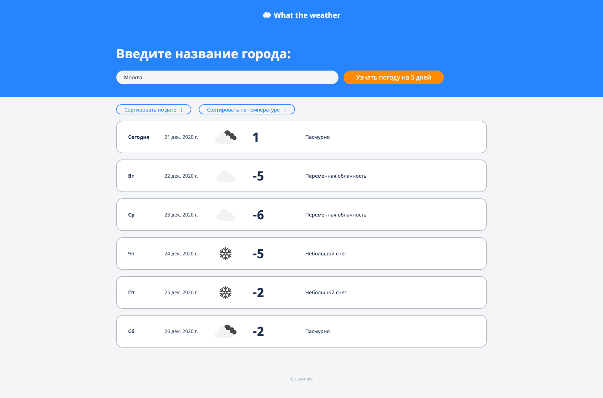

# Веб-приложение «What the weather»

«What the weather» — это сайт, позволяющий просматривать погоду в указанном городе на ближайшие 5 дней с возможностью сортировки списка по дате и температуре. Приложение адаптировано для использования как с десктопа, так и с мобильных устройств.

Проект сделан при помощи JavaScript-фреймворка Angular.

##### Скриншот главной страницы 



# Используемые технологии

- Angular 11.0.5
- TypeScript
- rxjs
- SCSS
 
# Возможности

- Просмотр погоды в любом городе на ближайшие 5 дней
- Отображение результатов поиска города в url и возможность поделиться ссылкой на погоду в конкретном городе
- Сортировка списка дней по дате и температуре в оба направления

# Демо/запуск проекта

Посмотреть можно по ссылке [https://mileor.github.io/weather](https://mileor.github.io/weather)

Чтобы запустить проект на своём компьютере — достаточно склонировать репозиторий и выполнить команды:
```
npm install
ng serve
```
После введения команд готовый проект будет доступен в браузере по ссылке [http://localhost:4200/](http://localhost:4200/)